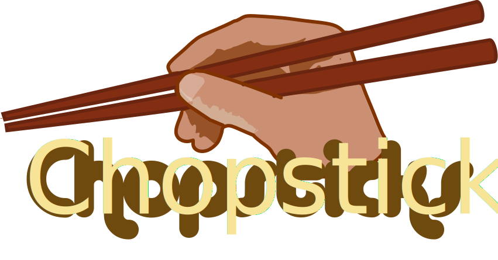

.. Chopsticks documentation master file, created by
   sphinx-quickstart on Thu Jul 21 07:59:54 2016.
   You can adapt this file completely to your liking, but it should at least
   contain the root `toctree` directive.

Chopsticks is an orchestration and remote execution library. It lets you run
Python code elsewhere: on remote hosts over SSH, in a Docker sandbox, on the
local host (optionally with ``sudo``) - even all of these in parallel.

Naturally this is agentless and nothing needs to be installed on remote
hosts except Python and an SSH agent.

Chopsticks was built for extensibility. Remote hosts may import Python code
from the orchestration host on demand, so remote agents can immediately use
new functions you define. In effect, you have access to the same codebase on
remote hosts as on the orchestration host.

As a taster, let's just get the unix time on a remote server called
``www.chopsticks.io``, then disconnect::

    import time
    from chopsticks.tunnel import SSHTunnel

    with SSHTunnel('www.chopsticks.io') as tun:
        print(tun.call(time.time))

Chopsticks Documentation
========================

Contents:

.. toctree::
    :maxdepth: 2

    intro
    tunnels
    groups
    queues
    howto
    examples
    changelog

Indices and tables
==================

* :ref:`genindex`
* :ref:`modindex`
* :ref:`search`

