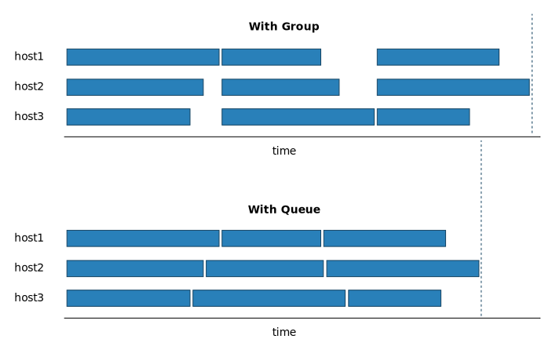

Queues
======

.. currentmodule:: chopsticks.queue

While :class:`Group` lets you run one operation across many hosts, Chopsticks'
:class:`Queue` class lets you run a number of different operations across many
hosts, so that each host is kept as busy as possible.

Conceptually, a ``Queue`` is actually a separate queue of operations for each
host. All hosts start their first operation as soon as :meth:`Queue.run()` is
called.

``Queue`` is also Chopsticks' primary *asynchronous* API; callbacks can be
registered which are called as soon as a result is available.

Queue API
---------

.. autoclass:: Queue
    :members:

.. autoclass:: AsyncResult
    :members:

Example
-------

Let's put three separate files ``a.txt``, ``b.txt`` and ``c.txt`` onto three
hosts::

    group = Group([
        'host1.example.com',
        'host2.example.com',
        'host3.example.com',
    ])

    queue = Queue()
    for f in ['a.txt', 'b.txt', 'c.txt']:
        queue.put(group, f, f)
    queue.run()

Let's compare this to an approach using the ``Group`` alone::

    group = Group([
        'host1.example.com',
        'host2.example.com',
        'host3.example.com',
    ])

    for file in ['a.txt', 'b.txt', 'c.txt']:
        group.put(f, f)

The ``Queue`` approach will typically run faster, because we do not wait for
all the tunnels to catch up after every transfer:

With a lengthy list of tasks, and inevitable variability in how long they take,
the Queue is likely to finish much sooner.
